# soma: local-first AI agent governance with verifiable, tamper-evident audit trails

soma is a small, zero-dependency runtime that governs AI agents and proves what they did. It wraps any agent command line under an enforced policy, records every action in a hash-chained audit log, and exports portable evidence that anyone can verify without trusting you, your vendor, or your cloud.

If you run AI agents at work and someone has to sign off on them (security, compliance, a client, an auditor, or the EU AI Act), soma gives you the receipts.



```
binary         883 KB   (release build, stripped)
dependencies   0        (Rust std only, the whole supply chain is src/)
tests          219      (cargo test)
memory         ~2 MB    peak RSS on a typical run
```

License: Apache-2.0. Status: v0.2.0. Platform: macOS and Linux.

## The problem soma solves

AI agents are becoming black boxes inside the enterprise. They pick tools, call APIs, edit files, and run commands, and most of the time you cannot show afterwards what an agent actually did or why. That is a problem the moment an agent touches anything that matters.

The agent control planes shipped by the large vendors in 2025 and 2026 answer part of this. They give you identity, a registry, and an audit log. But every one of those audit logs lives inside that vendor's cloud and trust boundary. You cannot hand a regulator or a client a record they can verify on their own machine, you cannot run the governance layer offline, and the trust root is always the vendor.

soma takes the opposite position:

1. Governance and evidence are local-first. A fresh project has zero network egress.
2. Evidence is portable. The audit trail verifies with nothing but a SHA-256 tool and a JSON reader.
3. The trust root is math, not a vendor. You recompute the hash chain yourself, and you can anchor it to an independent timestamp authority so even the operator cannot rewrite history.

## What you can do in ten minutes

```sh
# Build. No network needed, because there are no dependencies to fetch.
cargo build --release
alias soma=$PWD/target/release/soma

# Create a local-only project (no outbound network until you opt in).
soma init --name myproject

# Govern any AI agent CLI. The launch is policy-checked and fully journaled.
soma wrap --label fix-tests -- claude -p "fix the failing tests"

# Prove nobody edited the history.
soma log verify

# Export evidence anyone can check, with no soma required.
soma export

# Timestamp the journal head at an independent authority.
soma anchor now
```

That is the whole loop: govern an agent, journal what it did, anchor the proof, export evidence a stranger can verify. No account, no tenant, no per-seat license.

## Govern any AI agent CLI with `soma wrap`

`soma wrap` turns soma into a governance layer for the agents you already run, including Claude Code, GitHub Copilot CLI, and anything else with a command line. You do not integrate an SDK and you do not change the agent.

```sh
soma wrap --label nightly-refactor -- claude -p "refactor the storage layer"
```

What happens around that command:

- The launch is checked against your policy before the process starts. If the autonomy level is `observe`, or the command matches a deny rule, soma refuses and records the decision. Nothing runs.
- stdout and stderr stream through live, so the agent stays interactive, while soma hashes both streams with SHA-256 and keeps redacted excerpts.
- soma writes a `wrap.start` and a `wrap.end` receipt to the journal: label, command, exit code, duration, output hashes and sizes, and whether it timed out.
- The agent's exit code is preserved, so this drops straight into a script or CI job.

Honest limits, stated plainly. `soma wrap` policy-checks and journals the launch. It is not a syscall or network sandbox around the child process, and its command gate is a deny list of known-bad command forms, not a semantic guard. For hard isolation, run soma under a container or a restricted user. Pipes also flatten full-screen terminal UIs, so target headless and print modes such as `claude -p`.

## A tamper-evident audit log you can verify

Every action soma takes becomes an event in an append-only JSONL journal. Each event carries the SHA-256 of the previous event and a hash of itself, so the file is a hash chain.

```sh
soma log verify     # recompute the whole chain and point at the first edited line
```

Edit or delete a single line and `soma log verify` tells you exactly where. Redaction by key pattern runs before any event reaches disk, so secrets in environment variables never land in the log.

## Portable evidence anybody can check

```sh
soma export                 # writes a bundle plus a .tar.gz
soma export verify <dir>    # recompute every file hash and the full chain
```

An evidence bundle contains the journal, state snapshots, a manifest with the SHA-256 of every file, and a `VERIFY.md` that explains how to check everything with standard tools. A reviewer who has never heard of soma can confirm the bundle by hand. The export refuses to run if the chain does not verify, so there is no such thing as clean-looking evidence of a broken chain.

## Anchor the journal so even you cannot backdate it

A hash chain proves nobody edited the past. It does not, on its own, stop the operator from deleting the journal and regenerating a fresh one. `soma anchor` closes that gap by timestamping the journal head at an independent RFC 3161 authority.

```sh
soma anchor now      # POST the head hash to a public timestamp authority
soma anchor verify   # recompute the chain and check the timestamp
```

soma builds the RFC 3161 request by hand (no crypto dependency, the request encoder is a few dozen lines) and sends it with the system `curl`. A third party verifies the saved response with stock `openssl ts -verify` once they fetch the authority's root certificate. This proves the journal head existed at a point in time that you did not control, which means you cannot backdate history up to each anchored point.

To be precise about what this does and does not prove: anchoring proves non-backdating up to each anchored point, not completeness. Events appended after the last anchor, and soma writing its own journal, are outside that guarantee until the next anchor.

## EU AI Act Article 12 logging, generated from the journal

If you operate AI systems in or into the EU, Article 12 of the EU AI Act is the record-keeping obligation for high-risk systems. soma generates an auditor-ready Article 12 logging annex straight from the journal.

```sh
soma export eu-ai-act        # writes a Markdown annex plus a machine-readable .json
```

The annex documents the logging capability, an event taxonomy mapped to Article 12, period-of-use records, the integrity and tamper-evidence story, retention against the six-month floor in Articles 19 and 26, and reproducible verification instructions. It refuses to run on a broken chain.

It is honest about its own scope. It documents logging capability and records. It is not a conformity assessment, it is not legal advice, and it performs no Article 6 classification. Most development and coding agents are not high-risk under Annex III at all, and the document says so. It also prints both the in-force application date and the later date from the provisionally agreed Digital Omnibus, so the legal snapshot is clear.

## in-toto attestation and a GitHub Action for CI

```sh
soma export attestation      # in-toto Statement v1 over the journal head
```

The attestation's subject digest is the journal head hash, so it binds the exact evidence chain rather than a checksum of some file. soma does not sign it, by design, which keeps the runtime dependency-free. You sign it in CI with cosign or `gh attestation`. The included GitHub composite action runs an agent under soma policy, then exports the bundle and the attestation as build artifacts a reviewer can verify. See [docs/CI.md](docs/CI.md).

## Conformance to the Agent Control Specification

soma maps its policy gates onto Microsoft's Agent Control Specification (ACS), the open runtime-governance spec released in 2026. The mapping covers the intervention points soma implements and is honest about the gaps. soma's autonomy levels line up closely with ACS semantics: `observe` behaves like evaluate-only, `assist` routes to human approval, and `auto` enforces. See [docs/CONFORMANCE.md](docs/CONFORMANCE.md).

## Why zero dependencies

soma hand-rolls JSON, SHA-256, HTTP, RFC 3161 encoding, and cron parsing in about 1,400 lines of Rust, on purpose:

1. The supply chain is `src/`. Auditing a security-relevant agent runtime should not require auditing hundreds of transitive packages.
2. It runs where models barely fit. No async runtime and no TLS stack means a small, predictable memory footprint, which leaves the RAM for your local model.
3. Builds are fast and stable. A cold build is a few seconds, with no lockfile drift and no network at build time.

## Autonomy is a policy, not a mood

```
observe   plan and explain only, execution is refused and recorded
assist    execute, but a human applies any self-improvement proposals (default)
auto      execute and apply mechanical proposals automatically
```

On top of the autonomy level you get command allow and deny patterns, a network host allow list (localhost only by default), writable-path boundaries, and secret redaction. Every command, execution, network call, and path decision is journaled with the exact rule that fired. soma fails closed: a malformed policy file is refused rather than silently widened.

## Install and build

```sh
git clone https://github.com/radotsvetkov/soma
cd soma
cargo build --release
./target/release/soma --help
```

soma needs a recent Rust toolchain and nothing else.

## Project layout

```
src/        the runtime, hand-rolled and test-vectored
  json.rs sha256.rs util.rs http.rs       foundations
  events.rs export.rs                      hash-chained journal and evidence
  policy.rs project.rs                     autonomy policy, projects, presets
  skills.rs neuro.rs knowledge.rs          skills, explained selection, lessons
  models.rs cache.rs                       providers, routing, response cache
  goals.rs cron.rs improve.rs              workflows, schedules, proposals
  wrap.rs anchor.rs aiact.rs attest.rs     govern agents, anchor, AI Act, attest
  mcp.rs cli.rs                            MCP client, command dispatch
ci/         a GitHub Action for governed agent runs in CI
docs/        the JSON API, the ACS conformance mapping, CI usage
SPEC.md      the original requirements
```

## License

Apache-2.0. See [LICENSE](LICENSE).
